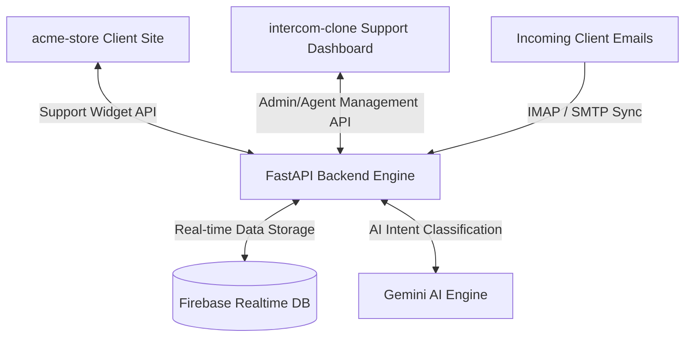

# Intercom-Style Live Support & AI Automation Suite

A multi-tenant, real-time live support system featuring an Admin Help Desk, Support Agent dashboard portals, customer storefront chat widgets, email synchronization pipelines, and automated AI routing engines.

---

## 🏗️ System Architecture

The application is split into three main components:



### 1. [Backend Engine](file:///c:/Users/vickey.kumar/Desktop/intercom/Backend)
- **FastAPI**: Serves endpoints with automated interactive OpenAPI/Swagger Documentation (`http://localhost:8000/docs`).
- **Firebase Integrations**: Provides database CRUD operations, listener connections, and Firebase Auth tokens.
- **IMAP/SMTP Mailboxes Listener**: Polls and monitors incoming customer support emails to register tickets automatically.
- **Gemini NLU Core**: Leveraged for user intent analysis, knowledge base retrieval, and automated AI chat agents response loops.

### 2. [Intercom Clone Support Dashboard](file:///c:/Users/vickey.kumar/Desktop/intercom/Frontend/intercom-clone)
- **Admin Desk**: Full control over settings, customized CNAME domains (e.g. `help.acme.com`), AI system personas, KB articles management, and global workspace stats.
- **Agent Portal**: Isolated dashboards presenting assigned threads queues, visual loading animations, and custom availability statuses.
- **SWR Caching**: Keeps chat rendering instantaneous via localized localStorage caches.

### 3. [Acme Store Mock Client Storefront](file:///c:/Users/vickey.kumar/Desktop/intercom/Frontend/acme-store)
- Includes the floating client live chat widget that coordinates AI suggestions, typing loaders, and direct agent escalations.

---

## 🗄️ Database Schema (Firebase Realtime Database)

The database schema is organized into modular paths to support rapid lookups:

*   **`admins/`**: Keyed by Admin UID; stores administrator metadata and profiles.
*   **`agents/`**: Keyed by Agent UID; stores supporting names, emails, activity status (Online/Offline), and assigned thread counts.
*   **`conversations/`**: Support tickets referencing user channels, priorities (Low, Medium, High), current status (Open, Pending, Closed), and assigned agent IDs.
*   **`customers/`**: Global registry containing customer profile details and support drawer history.
*   **`knowledge_base/`**: Collection of help articles indexed by matched intent categories.
*   **`messages/`**: Chat messages mapped in chronological order.
*   **`users/`**: Dynamic credentials metadata to verify logins.
*   **`workspaces/`**: Tenant configurations containing custom domains, DNS challenge tags, and SSL stubs.

---

## 🔌 API Summary (Swagger Interactive Routes)

*   **`POST /api/auth/login`**: Authenticates credentials and issues roles (Admin vs. Agent).
*   **`GET /api/auth/me`**: Fetches the authenticated user profile.
*   **`GET /api/conversations`**: Lists all active workspace support threads (supports agent filtering).
*   **`GET /api/conversations/{id}/messages`**: Fetches chat logs for the thread.
*   **`POST /api/conversations/{id}/messages`**: Sends new messages.
*   **`PUT /api/conversations/{id}`**: Updates thread properties (assignee agent, status, priority).

---

## 🚀 Quick Start Guide

### Step 1: Launch Backend Engine
```bash
cd Backend
python -m venv .venv
.\.venv\Scripts\activate
pip install -r requirements.txt
python scripts/seed_all.py
uvicorn app.main:app --reload
```

### Step 2: Launch Support Portal
```bash
cd Frontend/intercom-clone
npm install
npm run dev
```

### Step 3: Launch Mock Client Site
```bash
cd Frontend/acme-store
npm install
npm run dev
```
